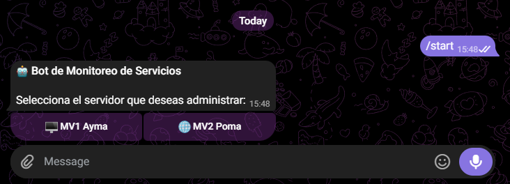
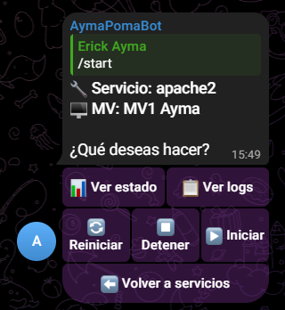
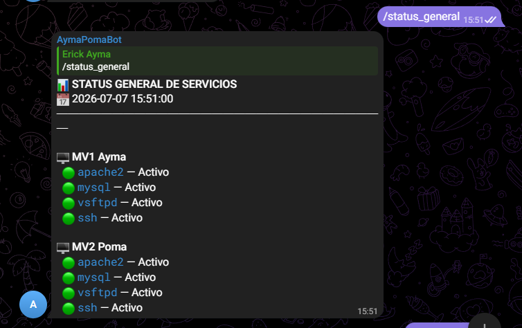
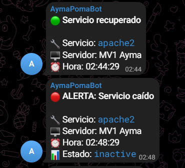
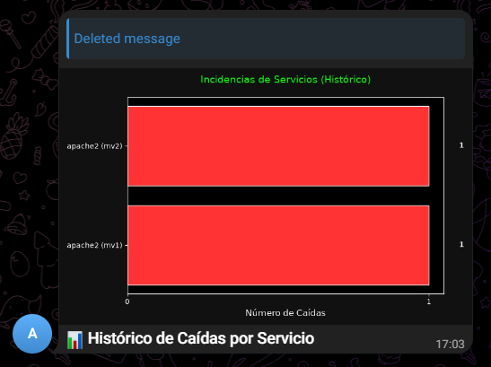

<div align="center">
  <a href="#" target="_blank">
    
  </a>
  <a href="#" target="_blank">
    
  </a>
  <a href="#" target="_blank">
    
  </a>
  <br />
  <br />
  <a href="https://git.io/typing-svg"></a>
</div>

<div align="center">
  <a href="#about">Acerca de</a> • <a href="#features">Características</a> • <a href="#architecture">Arquitectura</a> • <a href="#commands">Comandos</a> • <a href="#setup">Instalación</a> • <a href="#deploy">Despliegue</a>
</div>

<br />

<div align="center">


</div>

<br />

<div align="center">
  
</div>

---

<a name="about"></a>

## ⚡ Acerca del Proyecto

**NOC Bot** es un sistema centralizado de monitoreo y administración remota de servidores Linux a través de **Telegram**. Diseñado como un **Network Operations Center (NOC)** portátil, permite supervisar servicios críticos (Apache, MySQL, SSH, FTP), recibir alertas automáticas de caídas, ejecutar comandos remotos y generar reportes visuales — todo desde tu celular.

```python
noc_bot = {
    "tipo": "Bot de Telegram para Monitoreo de Infraestructura",
    "tecnologias": {
        "core": ["Python 3.11+", "python-telegram-bot v20+"],
        "ssh": ["Paramiko (conexiones SSH persistentes)"],
        "datos": ["SQLite (historial de eventos y métricas)"],
        "graficos": ["Matplotlib (reportes visuales de rendimiento)"],
        "deploy": ["Systemd (servicio persistente 24/7)"],
    },
    "capacidades": [
        "Monitoreo automático cada 60 segundos",
        "Alertas instantáneas de caídas y recuperaciones",
        "Reinicio, detención e inicio remoto de servicios",
        "Ejecución de comandos Linux arbitrarios",
        "Gráficos de rendimiento (CPU, RAM, histórico de caídas)",
        "Backups automáticos descargables por Telegram",
        "Resumen diario a las 8:00am",
    ],
}
```

---

<a name="features"></a>

## 🎯 Características Principales

### 🔔 Alertas en Tiempo Real
El bot revisa el estado de todos los servicios **cada 60 segundos**. Si detecta un cambio (caída o recuperación), envía una alerta instantánea al chat configurado.

### 🖥️ Menú Interactivo con Botones
Interfaz intuitiva con botones inline de Telegram. Navega entre servidores, servicios y acciones sin escribir comandos.

### 🔧 Administración Remota Completa
Reinicia, detiene o inicia servicios directamente desde Telegram. Cada acción pide confirmación y queda registrada en el historial.

### 📊 Gráficos y Estadísticas
Genera gráficos visuales del historial de caídas por servicio y rendimiento (CPU/RAM) por servidor con Matplotlib.

### 🛡️ Control de Acceso
Sistema de permisos por Chat ID. Solo administradores autorizados pueden ejecutar acciones críticas. Los demás usuarios pueden consultar información.

### 💾 Backups por Telegram
Genera y descarga backups de MySQL y archivos web directamente como archivos adjuntos en el chat.

---

## 📸 Capturas de Pantalla

<div align="center">
<table>
  <tr>
    <td><b>🏠 Menú Principal</b></td>
    <td><b>📊 Status General</b></td>
  </tr>
  <tr>
    <td></td>
    <td></td>
  </tr>
  <tr>
    <td><b>🔴 Alerta de Caída</b></td>
    <td><b>📈 Gráficos</b></td>
  </tr>
  <tr>
    <td></td>
    <td></td>
  </tr>
</table>
</div>

---

<a name="architecture"></a>

## 🏗️ Arquitectura del Sistema

```
┌──────────────────────────────────────┐
│         📱 Telegram (Usuario)        │
│   Comandos, Botones, Alertas         │
└──────────────────┬───────────────────┘
                   │ Bot API (HTTPS)
                   ▼
┌──────────────────────────────────────┐
│       🤖 NOC Bot (Python)           │
│  ┌────────────┐  ┌───────────────┐  │
│  │  bot.py    │  │ ssh_manager.py│  │
│  │ (Handlers) │  │ (SSH/Paramiko)│  │
│  └─────┬──────┘  └───────┬───────┘  │
│        │                 │          │
│  ┌─────┴──────┐  ┌───────┴───────┐  │
│  │  db.py     │  │ graficos.py   │  │
│  │ (SQLite)   │  │ (Matplotlib)  │  │
│  └────────────┘  └───────────────┘  │
│        config.py (.env)             │
└──────────────────┬───────────────────┘
                   │ SSH (Paramiko)
          ┌────────┴────────┐
          ▼                 ▼
┌──────────────────┐ ┌──────────────────┐
│  🖥️ MV1 Ayma    │ │  🌐 MV2 Poma    │
│  174.138.52.116  │ │  52.162.237.197  │
│  ─────────────── │ │  ─────────────── │
│  apache2, mysql  │ │  apache2, mysql  │
│  vsftpd, ssh     │ │  vsftpd, ssh     │
└──────────────────┘ └──────────────────┘
```

---

<a name="commands"></a>

## 📋 Comandos Disponibles

### 🖱️ Menú Interactivo
| Comando | Descripción |
|---|---|
| `/start` | Abre el menú principal con botones para elegir servidor |
| `/help` | Muestra la guía completa de uso |

### 📡 Consulta de Servicios
| Comando | Ejemplo | Descripción |
|---|---|---|
| `/estado <servicio> <mv>` | `/estado apache2 mv1` | Estado de un servicio específico |
| `/logs <servicio> <mv>` | `/logs mysql mv2` | Últimas líneas del log |
| `/status_general` | `/status_general` | Estado de todos los servicios |
| `/historial` | `/historial` | Últimos 10 eventos registrados |

### 🔧 Diagnóstico
| Comando | Ejemplo | Descripción |
|---|---|---|
| `/ping <mv>` | `/ping mv1` | Latencia hacia internet |
| `/uptime <mv>` | `/uptime mv2` | Tiempo encendido del servidor |
| `/graficas` | `/graficas` | Gráficos de rendimiento y caídas |

### 🔒 Administración (Solo Admin)
| Comando | Ejemplo | Descripción |
|---|---|---|
| `/reiniciar <servicio> <mv>` | `/reiniciar apache2 mv1` | Reinicia un servicio |
| `/backup <tipo> <mv>` | `/backup mysql mv1` | Genera y envía backup |
| `/ejecutar <mv> <cmd>` | `/ejecutar mv1 df -h` | Ejecuta cualquier comando Linux |

### 💬 Comandos de Texto Natural (sin `/`)
| Texto | Descripción |
|---|---|
| `ver espacio` | Almacenamiento en disco de ambas MVs |
| `ver memoria` | Uso de RAM de ambas MVs |
| `ver cpu` | Uso de CPU de ambas MVs |
| `ver usuario` | Usuarios conectados en ambas MVs |
| `estado servicio apache2` | Estado de apache2 en ambas MVs |
| `estado servicio mysql` | Estado de mysql en ambas MVs |
| `estado servicio ftp` | Estado de FTP (alias → vsftpd) |

### 🔔 Alertas Automáticas
| Evento | Comportamiento |
|---|---|
| 🔴 Servicio caído | Alerta instantánea al chat |
| 🟢 Servicio recuperado | Notificación automática |
| 📊 Resumen diario | Enviado a las 8:00am |

---

<a name="setup"></a>

## 🚀 Instalación Local

### Requisitos Previos
- **Python 3.10+** instalado
- Un **Bot de Telegram** creado con [@BotFather](https://t.me/BotFather)
- Acceso **SSH** a los servidores a monitorear

### Paso 1: Clonar el repositorio
```bash
git clone https://github.com/ErickEY-13/Bot_Telegram_Monitoreo_Servidores.git
cd Bot_Telegram_Monitoreo_Servidores
```

### Paso 2: Crear entorno virtual e instalar dependencias
```bash
python -m venv venv
source venv/bin/activate        # Linux/Mac
# venv\Scripts\activate          # Windows

pip install -r requirements.txt
```

### Paso 3: Configurar variables de entorno
```bash
cp .env.example .env
```

Edita `.env` con tus credenciales reales:
```env
TELEGRAM_BOT_TOKEN=tu_token_de_botfather
AUTHORIZED_CHAT_ID=tu_chat_id
ALERT_CHAT_ID=tu_chat_id_o_grupo

MV1_SSH_HOST=ip_servidor_1
MV1_SSH_USER=root
MV1_SSH_PASSWORD=tu_contraseña

MV2_SSH_HOST=ip_servidor_2
MV2_SSH_USER=tu_usuario
MV2_SSH_PASSWORD=tu_contraseña
```

### Paso 4: Ejecutar
```bash
python bot.py
```

---

<a name="deploy"></a>

## 🌐 Despliegue en Servidor (24/7)

Para que el bot corra permanentemente sin apagarse, se utiliza **systemd**:

```bash
# En el servidor, clonar y configurar
git clone https://github.com/ErickEY-13/Bot_Telegram_Monitoreo_Servidores.git /opt/bot_monitoreo
cd /opt/bot_monitoreo

# Instalar
python3 -m venv venv
source venv/bin/activate
pip install -r requirements.txt
cp .env.example .env && nano .env   # Configurar credenciales

# Instalar servicio systemd
sudo cp bot_monitoreo.service /etc/systemd/system/
sudo systemctl daemon-reload
sudo systemctl enable bot_monitoreo
sudo systemctl start bot_monitoreo
```

### Comandos útiles del servidor
```bash
systemctl status bot_monitoreo      # Ver estado
journalctl -u bot_monitoreo -f      # Logs en tiempo real
systemctl restart bot_monitoreo     # Reiniciar
systemctl stop bot_monitoreo        # Detener
```

> El servicio usa `Restart=always`, lo que garantiza que el bot se reinicia automáticamente si se cae o si el servidor se reinicia.

---

## 📁 Estructura del Proyecto

```
Bot_Telegram_Monitoreo_Servidores/
├── assets/                 # Imágenes y recursos del README
├── docs/                   # Documentación adicional
│   ├── GUIA_INICIO.md      # Guía de inicio rápido
│   ├── MANUAL_MV2.md       # Manual de configuración de MV2
│   ├── MANUAL_USUARIOS.md  # Manual de gestión de usuarios
│   └── FUNCIONALIDAD.md    # Guía completa de funcionalidades
├── bot.py                  # Lógica principal del bot (handlers y monitoreo)
├── config.py               # Configuración centralizada (tokens, servidores)
├── ssh_manager.py          # Gestión de conexiones SSH con Paramiko
├── db.py                   # Base de datos SQLite (historial y métricas)
├── graficos.py             # Generación de gráficos con Matplotlib
├── requirements.txt        # Dependencias de Python
├── .env.example            # Plantilla de variables de entorno
├── bot_monitoreo.service   # Archivo de servicio systemd
└── deploy.sh               # Script de despliegue automatizado
```

---

## 👤 Autor

<div align="center">
  
  <br /><br />
  <a href="https://github.com/ErickEY-13">
    
  </a>
</div>

---

## 📄 Licencia

Este proyecto fue desarrollado como proyecto académico universitario.

<div align="center">
  <br />
  
  
  <br />
  <br />

  ```
  ╔══════════════════════════════════════════════════════╗
  ║                                                      ║
  ║         Erick Yoel Ayma Choque  ✦  2026             ║
  ║         NOC Bot — Monitoreo de Servidores            ║
  ║                                                      ║
  ╚══════════════════════════════════════════════════════╝
  ```

  <sub>Hecho con ❤️ y Python 🐍 por <b>Erick Yoel Ayma Choque</b></sub>
</div>
