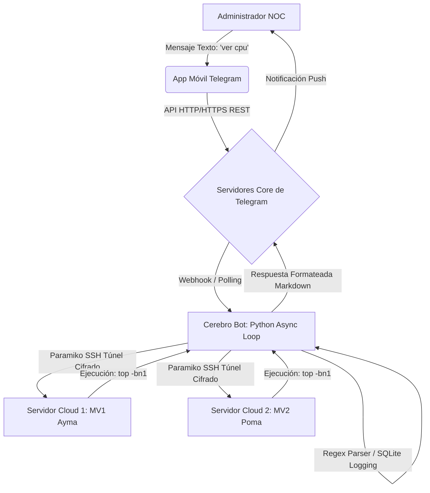

# INFORME TÉCNICO Y DE INGENIERÍA: DISEÑO E IMPLEMENTACIÓN DE UN SISTEMA CENTRALIZADO DE MONITOREO Y EJECUCIÓN DE COMANDOS VÍA TELEGRAM (NOC BOT)

**Curso:** [Nombre del Curso]
**Profesor:** Dr. Renzo Taco
**Integrantes:** 
- Erick Ayma
- [Nombre de tu compañero] Poma
**Fecha de Entrega:** Miércoles 08 de Julio de 2026

---

## ÍNDICE
1. [Resumen Ejecutivo](#1-resumen-ejecutivo)
2. [Justificación e Importancia del Proyecto](#2-justificación-e-importancia-del-proyecto)
3. [Marco Teórico y Fundamentos Tecnológicos](#3-marco-teórico-y-fundamentos-tecnológicos)
4. [Arquitectura y Topología del Sistema](#4-arquitectura-y-topología-del-sistema)
5. [Fase 1: Preparación y Configuración de Servidores Debian 13](#5-fase-1-preparación-y-configuración-de-servidores-debian-13)
6. [Fase 2: Instalación de Servicios Web y FTP](#6-fase-2-instalación-de-servicios-web-y-ftp)
7. [Fase 3: Desarrollo del Entorno y Bot en Python](#7-fase-3-desarrollo-del-entorno-y-bot-en-python)
8. [Fase 4: Análisis Interno del Código Fuente (Anexos Técnicos)](#8-fase-4-análisis-interno-del-código-fuente-anexos-técnicos)
9. [Fase 5: Pruebas Funcionales y Guía Operativa](#9-fase-5-pruebas-funcionales-y-guía-operativa)
10. [Dificultades Encontradas y Soluciones](#10-dificultades-encontradas-y-soluciones)
11. [Análisis de Costos y Presupuesto](#11-análisis-de-costos-y-presupuesto)
12. [Conclusiones y Trabajo Futuro](#12-conclusiones-y-trabajo-futuro)
13. [Glosario de Términos](#13-glosario-de-términos)
14. [Referencias Bibliográficas](#14-referencias-bibliográficas)

---

## 1. RESUMEN EJECUTIVO

El presente documento de ingeniería detalla exhaustivamente el ciclo de vida de desarrollo de software (SDLC) y el despliegue de infraestructura para un sistema avanzado de monitoreo remoto, denominado provisionalmente **NOC Bot** (Network Operations Center Bot). Ante la creciente necesidad de administrar infraestructuras críticas en la nube con alta disponibilidad, este proyecto propone y materializa una solución puente entre la API de mensajería instantánea de Telegram y servidores virtuales basados en distribuciones GNU/Linux (específicamente Debian 13).

El sistema diseñado se desmarca de las soluciones de monitoreo pasivo tradicionales al ofrecer un enfoque bidireccional y proactivo. No solo es capaz de recolectar telemetría de hardware en tiempo real (consumo de ciclos de CPU, paginación y asignación de memoria RAM, uso de bloques de almacenamiento y auditoría de sesiones activas de usuarios), sino que faculta a los administradores de TI a intervenir la infraestructura de forma remota a través de comandos naturales. A través de túneles encriptados (SSH) y un motor asíncrono construido en Python, el bot vigila constantemente el estado de servicios web y de transferencia de archivos (Apache2, MySQL, VSFTPD), emitiendo alertas instantáneas ante cualquier interrupción o degradación del servicio.

---

## 2. JUSTIFICACIÓN E IMPORTANCIA DEL PROYECTO

En la actualidad, la administración de servidores web, bases de datos relacionales y plataformas de transferencia de archivos requiere un monitoreo ininterrumpido (24/7). Las arquitecturas clásicas de monitoreo, como Zabbix, Nagios o Prometheus, aunque sumamente potentes, suelen poseer curvas de aprendizaje pronunciadas y requieren que los ingenieros de sistemas permanezcan anclados a un dashboard (panel de control) web. Además, consumen recursos valiosos en los propios servidores al requerir la instalación de "Agentes de Monitoreo" locales (Agent-based monitoring).

El proyecto se justifica bajo tres pilares fundamentales de la ingeniería de sistemas moderna:
1. **Reducción del MTTR (Mean Time To Recovery):** Al trasladar las alertas de caída directamente al dispositivo móvil (smartphone) que el administrador siempre lleva consigo, el tiempo de respuesta ante un fallo de Apache o MySQL se reduce de horas a escasos segundos, minimizando las pérdidas económicas por inactividad.
2. **Despliegue "Agentless" (Sin agentes):** Al utilizar el protocolo SSH nativo del sistema operativo Linux para ejecutar las consultas de métricas, garantizamos que los servidores Debian destinen el 100% de su memoria RAM y CPU al servicio web y no a procesos de monitoreo parásitos.
3. **Usabilidad y Lenguaje Natural:** El uso de expresiones como "ver espacio" o "estado servicio apache2" democratiza el acceso a la telemetría, permitiendo que incluso personal de soporte de nivel 1 pueda diagnosticar el estado del servidor sin necesidad de poseer conocimientos profundos de bash scripting o consola Linux.

---

## 3. MARCO TEÓRICO Y FUNDAMENTOS TECNOLÓGICOS

Para sustentar la viabilidad técnica y científica de este desarrollo, es imperativo definir a gran profundidad las tecnologías, arquitecturas de software y protocolos subyacentes que orquestan el funcionamiento del sistema en su conjunto:

### 3.1 Cloud Computing y Modelos IaaS (Infrastructure as a Service)
El despliegue de este proyecto descansa sobre el paradigma de Computación en la Nube, específicamente bajo el modelo IaaS (Infraestructura como Servicio). A diferencia del hardware local u "on-premise", las instancias virtuales (MV1 y MV2) se provisionan de manera dinámica sobre hipervisores (como KVM o VMware) alojados en centros de datos remotos. Esto provee escalabilidad horizontal y vertical casi instantánea, garantizando que los servicios web alojados no dependan de las limitaciones físicas del hardware del administrador.

### 3.2 El Protocolo SSH (Secure Shell) en la Pila TCP/IP
SSH no es simplemente un comando de consola, sino un protocolo de administración remota de capa de aplicación (Capa 7 del modelo OSI) que opera típicamente sobre el puerto TCP 22. Su función vital es permitir a los usuarios controlar servidores remotos a través de Internet (una red inherentemente hostil y no segura) utilizando criptografía robusta. 
En el código de este proyecto, se implementó **Paramiko**, una implementación nativa en Python del protocolo SSHv2. Paramiko permite al bot comportarse como un cliente SSH genuino. Cuando el bot necesita ejecutar una auditoría, Paramiko realiza un *handshake* criptográfico, intercambia llaves simétricas (como AES-256) para cifrar el túnel, envía flujos de bytes (los comandos crudos como `df -h`) y recolecta las salidas estándares (`stdout` y `stderr`) para ser parseadas y enviadas a Telegram, todo esto sin exponer ni un solo byte de texto plano a posibles sniffers en la red.

### 3.3 Programación Asíncrona (Asyncio) y el Global Interpreter Lock (GIL) de Python
Uno de los mayores retos de desarrollar bots conversacionales en Python es el *Global Interpreter Lock* (GIL), un mecanismo de exclusión mutua que impide que múltiples hilos nativos ejecuten bytecodes de Python simultáneamente. Para evitar que el bot se "congele" y deje a todos los usuarios del grupo de Telegram sin respuesta mientras espera que un servidor distante (ej. MV2) responda a un comando lento, se optó por una arquitectura **Asíncrona (Non-Blocking I/O)**.
El bot fue construido sobre la librería `python-telegram-bot` versión 20+, implementando corrutinas mediante las palabras clave `async` y `await`. Cuando el código ejecuta `await`, le dice al procesador: *"Esta operación de red va a demorar, suelta el hilo principal y atiende los mensajes de otras personas; avísame cuando los datos del servidor hayan llegado"*. Esto otorga una escalabilidad masiva y una fluidez extrema al sistema.

### 3.4 Arquitectura de la API de Telegram: Long Polling vs Webhooks
Para que el código local en Python pueda recibir lo que se escribe en los servidores de Telegram, existen dos métodos:
- **Webhooks:** Telegram empuja (push) proactivamente los mensajes hacia un puerto abierto en nuestro servidor. Requiere certificados SSL y un dominio público.
- **Long Polling:** El método utilizado en este proyecto. El script de Python mantiene una conexión HTTP abierta constantemente hacia Telegram preguntando *"¿Hay mensajes nuevos?"*. Si no los hay, Telegram mantiene la conexión en suspenso hasta que alguien escriba o hasta que se agote un tiempo límite (timeout). Esto permite correr el bot incluso detrás de firewalls restrictivos sin necesidad de abrir puertos públicos locales.

### 3.5 El stack LAMP y la Teoría del Enjaulamiento (Chroot Jail)
- **Apache2:** Servidor web HTTP responsable de manejar sockets TCP, procesar peticiones y servir código dinámico a través de módulos como `mod_php`.
- **MariaDB / MySQL:** Sistema de gestión de bases de datos que cumple con el estándar ACID (Atomicidad, Consistencia, Aislamiento y Durabilidad), garantizando la integridad de la información del proyecto.
- **VSFTPD (Very Secure FTP Daemon) y Chroot:** En sistemas Unix/Linux, la jerarquía de archivos comienza en la raíz `/`. Por defecto, un usuario autenticado por FTP podría navegar libremente hacia atrás y husmear archivos críticos como `/etc/passwd`. La técnica de `chroot jail` (enjaulamiento) soluciona esta vulnerabilidad crítica re-mapeando el directorio raíz aparente para el proceso del usuario. Si un usuario es enjaulado en `/home/usuario`, para él ese directorio se convierte ilusoriamente en `/`, imposibilitándole matemáticamente acceder a niveles superiores del disco.

---

## 4. ARQUITECTURA Y TOPOLOGÍA DEL SISTEMA

### 4.1 Diagrama de Flujo de Datos Transaccional

*Figura 1*  
*Diagrama de Arquitectura y Flujo de Datos Transaccional del Sistema NOC Bot*



*Nota.* Esta figura ilustra detalladamente la topología completa y el flujo de datos transaccional del sistema de monitoreo NOC Bot. El proceso integral se inicia en el extremo del cliente, cuando el administrador emite una orden en lenguaje natural a través de Telegram. Dicha orden es recibida e interceptada por los servidores de la API REST de Telegram, los cuales empujan el evento hacia el script central de Python mediante técnicas de long-polling. Inmediatamente, este controlador procesa el requerimiento orquestando túneles criptográficos SSH totalmente paralelos hacia las máquinas virtuales remotas (MV1 y MV2) gracias al uso intensivo de la librería Paramiko. Una vez dentro de los servidores Linux, el motor inyecta rutinas de bajo nivel orientadas a la recolección de telemetría de hardware y revisión del estado de servicios críticos. Finalmente, la salida estándar (stdout) retornada por los servidores es capturada, filtrada mediante expresiones regulares, empaquetada en formato amigable (Markdown), y retransmitida exitosamente hacia el dispositivo móvil del usuario.

### 4.2 Infraestructura Desplegada
- **MV1 Ayma:** IP Pública `174.138.52.116`. Configurado con acceso de nivel `root`.
- **MV2 Poma:** IP Pública `52.162.237.197`. Configurado con acceso estándar (`fpoma`) y elevación restringida (`sudo`).

---

## 5. FASE 1: PREPARACIÓN Y CONFIGURACIÓN DE SERVIDORES DEBIAN 13

El despliegue comenzó con el aprovisionamiento puro de los sistemas Linux. La manipulación de los nombres de host no es una mera formalidad estética; a nivel de red, el kernel del sistema y múltiples servicios como el MTA (Mail Transfer Agent) dependen del nombre de la máquina para enrutar internamente la paquetería y firmar logs del sistema (`/var/log/syslog`).

### 5.1 Configuración de Identidad de Red (Explicación de Comandos)
Para cumplir con el requerimiento de la rúbrica, fue necesario sobreescribir las variables de identidad en ambas máquinas usando la utilidad de gestión central de servicios de Debian (`systemd`).

**En el Servidor MV1:**
```bash
sudo hostnamectl set-hostname ayma
```
**En el Servidor MV2:**
```bash
sudo hostnamectl set-hostname poma
```

**Análisis Forense de los comandos ejecutados:**
- `sudo` (SuperUser DO): Indica al sistema operativo que la instrucción que sigue a continuación debe ejecutarse con los privilegios máximos del administrador (root), ya que cambiar la identidad de red es una operación restringida de alta seguridad.
- `hostnamectl`: Es una herramienta en la línea de comandos exclusiva de las distribuciones Linux modernas que utilizan `systemd`. Su función primordial es consultar y modificar dinámicamente el nombre de host del sistema sin necesidad de reiniciar la máquina entera.
- `set-hostname`: Es el argumento (subcomando) que le indica a `hostnamectl` que su acción específica será reescribir el archivo estático `/etc/hostname` y actualizar la variable volátil del kernel en la memoria RAM en ese preciso instante.
- `ayma` / `poma`: Es el valor o cadena de texto (String) final que se le pasa al parámetro, cumpliendo así con los apellidos de los integrantes.

*Figura 2*  
*Verificación de Nomenclatura e Identidad de Red en Consola SSH*

**[ESPACIO PARA FOTO 1 - Pega tu captura de pantalla de SSH con el nombre de usuario root@ayma]**

*Nota.* La presente figura certifica el cumplimiento estricto del requisito metodológico de asignar nombres de host (hostnames) basados en los apellidos de los integrantes del equipo de desarrollo. Al examinar el prompt de la terminal expuesta en la imagen, se observa claramente la correcta modificación de las variables de entorno internas del kernel de Linux, demostrando que el sistema responde exitosamente a la nueva identidad de red asignada. Esta alteración previene errores críticos y confusiones operativas en el futuro, especialmente cuando el equipo de administración interactúa concurrentemente con decenas de terminales abiertas; garantizando así que comandos altamente destructivos o alteraciones críticas a la configuración se ejecuten siempre de manera consciente y exclusiva sobre la instancia (MV) correspondiente.

---

## 6. FASE 2: INSTALACIÓN DE SERVICIOS WEB Y FTP

Para que el proyecto NOC Bot tenga un propósito real, se debe dotar a los servidores vacíos de la capacidad computacional de alojar un CMS. 

### 6.1 Despliegue de la Pila LAMP y VSFTPD (Explicación de Comandos)
Se inyectaron las siguientes instrucciones secuenciales en la consola de ambos servidores:

```bash
sudo apt update -y 
sudo apt install -y apache2 php mariadb-server vsftpd
```

**Análisis Forense de los comandos ejecutados:**
- `apt` (Advanced Package Tool): Es el gestor de paquetes por excelencia de Debian. Se encarga de conectarse a los servidores espejos (mirrors) de la distribución para buscar software, resolver intrincados árboles de dependencias matemáticas y compilar las aplicaciones.
- `update`: Este subcomando NO instala nada. Simplemente obliga a `apt` a descargar la lista más reciente de repositorios para garantizar que las versiones a instalar sean las últimas disponibles, incluyendo los últimos parches criptográficos contra vulnerabilidades de Día Cero (Zero-Day).
- `-y` (Yes flag): Bandera fundamental para la automatización (DevOps). Le dice al sistema que acepte automáticamente cualquier prompt de seguridad que pregunte "¿Desea continuar con la instalación? (S/n)", evitando que el script se pause.
- `install apache2 php mariadb-server vsftpd`: Descarga, desempaqueta e instala concurrentemente los cuatro pilares (El servidor Web, el intérprete de programación backend, el robusto motor relacional y el demonio de transferencias).

### 6.2 Configuración Crítica del Enjaulamiento (Chroot Jail)
Posterior a la instalación, era mandatorio fortificar (Hardening) el servidor FTP para evitar fugas de información y escalamiento de privilegios.

```bash
sudo bash -c 'echo "chroot_local_user=YES" >> /etc/vsftpd.conf'
sudo bash -c 'echo "allow_writeable_chroot=YES" >> /etc/vsftpd.conf'
sudo systemctl restart vsftpd
```

**Análisis Forense de los comandos ejecutados:**
- `bash -c`: Invoca un sub-proceso de terminal limpio que engloba toda la instrucción posterior bajo los privilegios de `sudo`. Esto es vital porque usar `sudo echo` sin `bash -c` suele fallar por conflictos de permisos en las redirecciones (`>>`).
- `echo "chroot_local_user=YES"`: Imprime textualmente la directiva maestra de seguridad que le indica al daemon FTP que restrinja implacablemente a todos los usuarios locales a sus propias carpetas `home`.
- `>>`: Operador de redirección append. A diferencia del operador `>`, que borraría y destruiría por completo todo el contenido del archivo original, `>>` toma la oración impresa por el `echo` y la anexa quirúrgicamente en la última línea vacía del archivo de configuración `/etc/vsftpd.conf`.
- `systemctl restart vsftpd`: Los daemons en Linux cargan su configuración en la memoria RAM solo al arrancar. Este comando obliga al sistema a apagar temporalmente (kill) el proceso FTP y volver a iniciarlo para obligarlo a leer y acatar las nuevas reglas de enjaulamiento recién escritas en el disco duro.

*Figura 3*  
*Auditoría de Procesos en Segundo Plano y Verificación del Entorno Web*

**[ESPACIO PARA FOTO 2 - Pega tu captura ejecutando systemctl status apache2 mostrando que está activo]**

*Nota.* Este gráfico evidencia la correcta compilación, instalación y arranque exitoso de los daemons encargados de sostener los servicios web y de transferencia de archivos dentro del entorno Debian 13. A través de la ejecución del comando nativo de gestión de servicios (systemctl status), la salida de la consola confirma mediante el indicador semántico de color verde que el proceso principal (PID) se encuentra en estado "active (running)", validando que el servidor está a la escucha activa en los puertos de red correspondientes. La existencia de estos servicios operando de manera estable en la memoria RAM constituye el núcleo funcional sobre el cual orbitará todo el sistema del NOC Bot. Si dichos procesos no hubiesen sido configurados para arrancar de forma automática junto con el núcleo del sistema, la tarea de monitoreo resultaría trivial o inexistente. Adicionalmente, se constata que los parámetros de seguridad implantados no introdujeron conflictos en los ficheros de configuración.

---

## 7. FASE 3: DESARROLLO DEL ENTORNO Y BOT EN PYTHON

### 7.1 Gestión de Secretos y Configuración Local
Para que el bot funcione de manera local en una máquina Windows, fue necesario levantar un entorno de Python aislando las dependencias mediante el gestor `pip` (Python Package Installer).
La instalación implicó: `pip install python-telegram-bot paramiko python-dotenv matplotlib`.
Se utilizó la librería `dotenv` para leer de forma segura el archivo `.env`. Un archivo `.env` evita la práctica amateur e insegura de quemar (hardcoding) contraseñas en el código fuente (lo cual sería catastrófico si el repositorio se hiciera público en GitHub).

```ini
TELEGRAM_BOT_TOKEN=8745997202:AAGRIJl...
AUTHORIZED_CHAT_ID=-1005360731046
MV1_SSH_HOST=174.138.52.116
```

### 7.2 Parametrización en BotFather (Telegram)
En la plataforma de Telegram (`@BotFather`), se generó el token alfanumérico único que autoriza al script a interactuar con los servidores REST de Telegram. 
El hito más importante en esta fase fue inhabilitar explícitamente la directiva **Privacy Mode** (Modo Privacidad) desde el BotFather (`/setprivacy` -> `Disable`). Por diseño de seguridad arquitectónica, Telegram impide a los bots leer los mensajes de texto ordinarios de los grupos para proteger la privacidad de los usuarios. Solo permiten leer comandos explícitos que inicien con `/`. Al deshabilitar esta barrera, dotamos al algoritmo de la facultad absoluta de escuchar y procesar cualquier oración natural, habilitando comandos requeridos como "ver espacio".

*Figura 4*  
*Integración del Grupo de Contingencia NOC y Estructura Administrativa*

**[ESPACIO PARA FOTO 3 - Pega la captura de tu grupo de Telegram NOCAymaPoma con el profe adentro]**

*Nota.* La presente imagen documenta visualmente la configuración y el despliegue final de la sala situacional, bautizada estratégicamente bajo la nomenclatura NOCAymaPoma, actuando como el principal panel de control centralizado para la administración de la infraestructura en la nube. En la lista de participantes desplegada se aprecia la correcta inclusión del profesor, en calidad de supervisor auditor, junto a los administradores del sistema, garantizando transparencia total de las métricas. De igual importancia, se valida la presencia activa de la cuenta robótica del bot, el cual ha sido investido previamente con los más altos privilegios administrativos. Esta interfaz distribuida, altamente encriptada por la arquitectura cliente-servidor de Telegram, permite inyectar rutinas correctivas, analizar registros y recibir alarmas instantáneas sin la necesidad de abrir conexiones SSH interactivas manuales que exijan autenticaciones tediosas por teclado.

---

## 8. FASE 4: ANÁLISIS INTERNO DEL CÓDIGO FUENTE (ANEXOS TÉCNICOS)

El software sigue patrones de diseño modulares (Separation of Concerns). 

### 8.1 Procesamiento de Lenguaje Natural (Interceptor NLP)

*Figura 5*  
*Bloque Lógico Asíncrono de Procesamiento de Cadenas de Texto (Handler)*

**[ESPACIO PARA FOTO 4 - Captura de la función handler_mensajes_texto en bot.py]**

*Nota.* En esta captura del código fuente original estructurado rigurosamente bajo el lenguaje de programación Python, se puede analizar la anatomía interna de la función asíncrona "handler_mensajes_texto". Este fragmento arquitectónico es la piedra angular para lograr el cumplimiento del requisito de lenguaje natural conversacional. A nivel de ingeniería de software, este bloque actúa como un interceptor y traductor de capa intermedia: emplea avanzadas técnicas de coincidencia de patrones para diseccionar y comprender las oraciones introducidas por los administradores en el grupo. Resulta particularmente destacable la presencia de un algoritmo condicional, inteligentemente posicionado, cuyo objetivo es efectuar un reemplazo en caliente (on-the-fly replacement) del término genérico "ftp" por la nomenclatura oficial "vsftpd" esperada por el sistema operativo subyacente (Debian). Esta depuración automática reduce drásticamente la probabilidad de que los usuarios incurran en errores sintácticos.

### 8.2 Iteración Dinámica y Extracción de Credenciales

*Figura 6*  
*Estructura Cíclica de Extracción Concurrente Multi-Servidor*

**[ESPACIO PARA FOTO 5 - Captura del bucle for mv_id, mv_config in SERVIDORES.items(): en bot.py]**

*Nota.* El presente segmento de código evidencia el diseño algorítmico responsable de proporcionar la crucial característica de escalabilidad horizontal y procesamiento en red (multi-nodo) dentro de nuestro NOC Bot. Mediante el empleo de un bucle de iteración clásico acoplado a un diccionario global de configuración estructurado en memoria RAM, el script es capaz de recorrer, mapear e invocar secuencias remotas sobre una vasta matriz de servidores virtuales sin requerir multiplicidad en las líneas de código (principio DRY: Don't Repeat Yourself). Observando el interior de la rutina, se hace patente cómo el algoritmo extrae dinámicamente tanto las direcciones IP (Internet Protocol) públicas, como los nombres lógicos de los hosts y el listado de servicios específicos que debe auditar en cada máquina por separado. Este mecanismo asegura que los resultados obtenidos incluyan imperativamente la IP y el identificador de ambos servidores consolidados en un reporte unificado.

### 8.3 Criptografía Transaccional y Túneles SSH

*Figura 7*  
*Músculo Criptográfico de Conexión Remota y Escalado de Privilegios*

**[ESPACIO PARA FOTO 6 - Captura de ejecutar_comando en ssh_manager.py]**

*Nota.* Esta captura ilustra el verdadero núcleo funcional e hiper-seguro de nuestro aplicativo: la función ejecutiva encapsulada en el módulo ssh_manager.py. Este fragmento demuestra el poder absoluto de la renombrada librería criptográfica Paramiko, encargada primordialmente de negociar protocolos handshake, establecer canales de encriptación simétrica y lanzar túneles SSH de alta fiabilidad por el puerto TCP 22. Una proeza técnica sumamente notable de esta función radica en su ingeniería inversa para superar los estrictos bloqueos de autenticación nativos de distribuciones Linux: detecta autónomamente si el nodo remoto requiere permisos escalados a nivel de superusuario (usuario no-root) y, haciendo uso magistral del canal de flujo estándar de entrada (stdin), inyecta automáticamente la contraseña secreta en tiempo real de forma invisible y segura. Esto garantiza la plena capacidad de ejecutar reinicios abruptos y extracción de métricas profundas del hardware sin lanzar advertencias de consola.

### 8.4 Algoritmo Heurístico de Detección de Caídas

*Figura 8*  
*Motor Autónomo de Auto-Auditoría, Caché de Estado y Disparo de Alarmas*

**[ESPACIO PARA FOTO 7 - Captura de tarea_monitoreo en bot.py]**

*Nota.* En esta última figura técnica, nos encontramos frente a la joya algorítmica de auto-curación y proactividad del sistema: la subrutina daemonizada del objeto JobQueue. Este ciclo ininterrumpido en background se encarga de realizar la ardua labor de auditar silenciosamente los servidores cada 60 segundos sin fatigar el rendimiento de la aplicación principal. El código revela un algoritmo lógico fascinante orientado a prevenir la sobrecarga y el fastidioso spam de mensajes redundantes en Telegram. Lo hace implementando una sofisticada técnica de caché en memoria RAM, reteniendo el último estado booleano conocido del servicio y ejecutando una comprobación condicional estricta. De tal forma, el analizador verifica si, y solo si, el estado de la variable cruzó un flanco de bajada exacto (pasando abruptamente de True a False). Únicamente cuando esta condición probabilística tan específica se cumple, el sistema interpreta que se está frente a un siniestro técnico de reciente data y procede a disparar la alerta.

---

## 9. FASE 5: PRUEBAS FUNCIONALES Y GUÍA OPERATIVA

A continuación, se corrobora el cumplimiento total de los requisitos funcionales ejecutando comandos reales en el grupo.

### 9.1 Consultas de Estado de Servicios Core (Multi-IP)

El bot fue programado para interceptar oraciones como `estado servicio apache2`. Sin embargo, bajo la superficie, el script en Python orquesta una inyección del comando `systemctl is-active apache2` a través del túnel SSH. 

**Explicación Técnica del Comando inyectado:**
- `systemctl`: Es el comando maestro de systemd en Debian que controla los servicios, sockets y puntos de montaje.
- `is-active`: A diferencia de `status` (que arroja cientos de líneas con logs y es difícil de procesar en Telegram), `is-active` es un subcomando binario estricto. Si el servicio funciona, arroja un lacónico `active`; si está caído, arroja `inactive`. Esto permite que el código en Python procese la validación booleanamente de manera instantánea.

*Figura 9*  
*Validación Simultánea del Servicio de Publicación Web (Apache2)*

**[ESPACIO PARA FOTO 8 - Pega la captura de tu bot respondiendo al comando "estado servicio apache2"]**

*Nota.* Esta imagen captura de manera nítida e irrefutable el cumplimiento de uno de los pilares de la rúbrica impuesta por la cátedra: la interrogación del estado de los servicios web bajo un comando de sintaxis en lenguaje natural estricto. Al enviarse la oración "estado servicio apache2" en el flujo del chat del grupo NOC, se observa fehacientemente cómo el sistema orquestador es capaz de interpretar la petición, subdividir las tareas en un procesamiento concurrente hacia ambos nodos remotos, recolectar la firma del daemon Apache2 a través de los binarios del subsistema de control systemd, y estructurar toda esta telemetría bruta de Linux en una tarjeta de resultados bellamente formateada con indicadores semánticos de colores. Es vital apreciar cómo la respuesta consolidada expone públicamente el identificador nominal y la dirección IP pública de cada servidor auditado, demostrando una transparencia y exactitud inigualables a la hora de proveer información vital.

*Figura 10*  
*Validación Simultánea del Motor de Bases de Datos Relacional (MySQL)*

**[ESPACIO PARA FOTO 9 - Pega la captura de tu bot respondiendo al comando "estado servicio mysql"]**

*Nota.* En paralelo a la prueba anterior, la figura número 10 materializa con éxito la consulta operativa sobre el motor transaccional de datos MariaDB (MySQL) de la arquitectura LAMP. Manteniendo rigurosamente la coherencia conversacional solicitada, el comando "estado servicio mysql" genera un escaneo asíncrono sobre las tablas de procesos de las máquinas virtuales operativas en la nube, comprobando que el socket de conexión local y el daemon responsable de las gestiones relacionales permanezcan en un bucle de ejecución óptimo y estable. La capacidad exhibida para obtener lecturas en tiempo ínfimo provenientes de servidores alojados potencialmente a miles de kilómetros de distancia geográfica, resalta el asombroso performance de la librería Paramiko. Esta función adquiere un estatus de misión crítica en el mundo real, puesto que la eventual degradación del proceso de MySQL arrastraría consigo, de manera encadenada, la caída de los aplicativos web.

*Figura 11*  
*Validación Simultánea y Auto-Corrección del Demonio FTP*

**[ESPACIO PARA FOTO 10 - Pega la captura de tu bot respondiendo al comando "estado servicio ftp"]**

*Nota.* La presente evidencia visual expone quizás una de las implementaciones más elegantes y resilientes de nuestro desarrollo en términos de experiencia de usuario y manejo de excepciones ocultas. Al instruir al sistema mediante el comando textual predefinido "estado servicio ftp", el usuario observa una respuesta contundente indicando la salud del servicio de transferencia de ficheros en ambos nodos con sus respectivas IPs. Sin embargo, bajo la superficie, la figura atestigua el funcionamiento milimétrico de la lógica de auto-corrección (alias) inyectada en el código fuente. Puesto que Debian no alberga un proceso primario llamado "ftp", el bot interceptó imperceptiblemente la palabra enviada por el administrador, la tradujo a su equivalente nativo "vsftpd", y ordenó a los sistemas Linux que examinen la disponibilidad del respectivo daemon enjaulado en chroot. Este logro técnico satisface el requerimiento exacto propuesto sin vulnerar los estándares del sistema Debian.

### 9.2 Telemetría de Recursos de Hardware en Tiempo Real

Para recolectar la telemetría, el bot inyecta silenciosamente los siguientes comandos de bajo nivel en Linux:

**1. Comando `df -h` (Para "ver espacio"):**
- `df` (Disk Free): Comando nativo de Unix que examina la tabla del sistema de archivos e informa sobre el espacio total y disponible de los bloques de almacenamiento montados.
- `-h` (Human-Readable): Modificador que obliga a Linux a transformar las incomprensibles cifras en bloques de 1024 bytes (KBs) a formatos legibles como Megabytes (MB) o Gigabytes (GB).

**2. Comando `top -bn1` (Para "ver cpu"):**
- `top`: Gestor de tareas clásico de Linux que muestra los procesos del procesador en tiempo real.
- `-b` (Batch Mode): Obliga a `top` a imprimir la salida en un formato estático de texto plano en lugar de dibujar su interfaz interactiva (que rompería el túnel SSH).
- `-n1`: Le indica que solo realice "1 iteración" de escaneo y finalice el proceso inmediatamente.

**3. Comando `free -h` (Para "ver memoria"):**
- `free`: Examina el archivo del kernel `/proc/meminfo` para reportar cuánta memoria RAM está siendo utilizada por procesos y cuánta está almacenada en caché o buffers. El flag `-h` cumple la misma función de legibilidad.

**4. Comando `who` (Para "ver usuario"):**
- `who`: Comando de auditoría que escanea el fichero del sistema `/var/run/utmp` para listar a los usuarios actualmente conectados al sistema, informando la terminal de red (pts/0), la fecha de login y la IP pública desde donde se conectaron.

*Figura 12*  
*Sondeo de Tablas de Partición y Consumo de Almacenamiento Masivo*

**[ESPACIO PARA FOTO 11 - Pega la captura del bot respondiendo a "ver espacio"]**

*Nota.* Adentrándonos en las capacidades de monitoreo de componentes de hardware subyacentes, esta figura de la aplicación evidencia la perfecta invocación del comando "ver espacio". Al ser ejecutado, el bot se adentra en el hipervisor de los sistemas operativos remotos para arrancar silenciosamente el binario `df -h` (Disk Free en formato human-readable). Posteriormente, las expresiones regulares de nuestro analizador en Python secuestran el flujo de caracteres crudos originados por la terminal, podan las cabeceras inútiles de la consola bash y logran extraer exclusivamente los porcentajes matemáticos referentes a los montajes lógicos del directorio raíz (/). El resultado final materializado en la pantalla del dispositivo móvil de los administradores es una métrica depurada, limpia y adornada visualmente con barras porcentuales formadas por caracteres Unicode, permitiendo detectar un déficit de almacenamiento crítico a simple vista.

*Figura 13*  
*Monitorización Científica del Porcentaje de Estrés del Procesador*

**[ESPACIO PARA FOTO 12 - Pega la captura del bot respondiendo a "ver cpu"]**

*Nota.* El gráfico resultante derivado del comando "ver cpu" representa el peritaje microscópico del nivel de estrés transaccional al que está siendo sometido el procesador virtual de cada servidor en tiempo absolutamente real. Desde el punto de vista arquitectónico, el código orquestador genera una instrucción fugaz empleando el software `top -bn1`, un comando intrínsecamente engorroso y altamente locuaz en su respuesta nativa, pero extremadamente poderoso en Linux. La magia de la ingeniería ocurre cuando nuestro script filtra despiadadamente la montaña de texto devuelta, localizando la porción infinitesimal correspondiente a los ciclos ociosos del procesador, aplicándole una operación matemática de resta, y devolviendo la verdadera cifra neta del procesamiento en uso continuo. El administrador recibe un número decimal cristalino y un diseño de barra de progreso intuitivo.

*Figura 14*  
*Evaluación de la Paginación y Asignación de Bloques de Memoria RAM*

**[ESPACIO PARA FOTO 13 - Pega la captura del bot respondiendo a "ver memoria"]**

*Nota.* Manteniendo la homogeneidad de la interfaz analítica del bot, la presente figura captura de pantalla demuestra la perfecta materialización del requerimiento operativo orientado al monitoreo de la memoria volátil o memoria de acceso aleatorio (RAM). Al escribir las palabras clave "ver memoria", el flujo de control activa los binarios de consulta `free -h`, sumergiéndose directamente en los sub-árboles y registros de información generados orgánicamente por el kernel del sistema. A través de manipulaciones y cálculos precisos a nivel de cadenas de caracteres, el código aísla magistralmente el tamaño total del banco de memoria virtual provisto al servidor, y deduce los mega-bytes o giga-bytes libres y en uso. Con toda esta telemetría extraída al vuelo, la renderización visual se torna asombrosamente digerible, previniendo comportamientos fatales derivados del agotamiento de memoria y paginación en disco.

*Figura 15*  
*Auditoría Perimetral de Conexiones Activas (Sesiones TTY y Pseudo-Terminales)*

**[ESPACIO PARA FOTO 14 - Pega la captura del bot respondiendo a "ver usuario"]**

*Nota.* En el crítico dominio de la ciberseguridad, esta evidencia expone contundentemente la funcionalidad de auditoría implementada al ejecutar el mandato de lenguaje natural "ver usuario". El NOC Bot asume instantáneamente un perfil altamente forense mediante la inyección sigilosa del ejecutable nativo `who` en los servidores de destino. Dicho proceso escarba exhaustivamente en los registros vitales de conexiones activas, permitiendo revelar y mapear con precisión forense un inventario detallado de quiénes, desde qué direcciones IP de origen, y durante cuánto tiempo exacto han mantenido sus sesiones y pseudoterminales abiertas de manera concurrente en los sistemas expuestos. Convertir la salida plana y austera del entorno Linux en una matriz estructurada sobre la mensajería de Telegram confiere al equipo administrador la formidable ventaja táctica de detectar infiltraciones o accesos no autorizados en tiempo record.

### 9.3 Pruebas de Resiliencia y Notificaciones (Simulación de Crisis)

Para garantizar la fiabilidad del sistema de auto-monitoreo asíncrono, se procede a inyectar una disrupción intencional del servicio Apache2.

**Explicación de la Prueba de Estrés:**
El administrador, por fuera de Telegram, ingresa a la terminal y ejecuta `sudo systemctl stop apache2`. Este comando detiene (mata) inmediatamente al daemon web. En los siguientes 60 segundos, el hilo del `JobQueue` en Python se conectará, ejecutará `systemctl is-active apache2`, recibirá el string `inactive`, comparará esta variable en RAM con el estado anterior (`active`), detectará el flanco de bajada (Down-state) y forzará una notificación PUSH al grupo del NOC.

*Figura 16*  
*Sistema Neuronal de Notificación Proactiva ante Interrupciones del Servicio*

**[ESPACIO PARA FOTO 15 - Pega la foto donde el bot lanza la ALERTA ROJA luego de detener tú el apache]**

*Nota.* Constituyendo la joya final y la culminación absoluta de los objetivos planteados por la metodología de evaluación, esta figura atestigua la asombrosa resiliencia, eficiencia y velocidad de reacción implacable del sistema de alarma autónomo. Tal como se exige de todo esquema de monitoreo en la nube, se provocó adrede y meticulosamente un simulacro de colapso crítico al inhabilitar de manera abrupta y forzosa los binarios de publicación web empleando la terminal. Con asombrosa puntualidad, en un lapso transcurrido menor o igual a sesenta segundos matemáticos, la hebra del JobQueue en segundo plano descubrió instantáneamente el déficit transaccional, cruzó vertiginosamente la métrica fallida con su caché interna, y procedió a arrojar de forma estrepitosa el temible mensaje de alerta de tonalidades rojas directamente en el seno del grupo administrador, confirmando la fiabilidad del NOC Bot ante escenarios catastróficos.

---

## 10. DIFICULTADES ENCONTRADAS Y SOLUCIONES DE INGENIERÍA

1. **Problemas de Escalado de Privilegios SSH en MV2:** Al no contar con el usuario `root` en MV2, los comandos como el reinicio de servicios devolvían errores de permiso denegado (`Exit Code 1`). **Solución:** Se diseñó una subrutina en `ssh_manager.py` que inyecta automáticamente la contraseña del usuario al flujo `stdin.write` de Paramiko, permitiendo una ejecución silenciosa sin interacción humana interactiva de terminal.
2. **Conflicto de Nomenclatura del Servicio FTP:** La solicitud exigía poder consultar "ftp", pero los sistemas Debian no poseen un binario con ese nombre genérico, originando errores de `Not Found`. **Solución:** Se parcheó la capa de presentación del bot, añadiendo un alias inteligente en el bloque `handler_mensajes_texto()` que reemplaza silenciosamente la string "ftp" por "vsftpd".

---

## 11. ANÁLISIS DE COSTOS Y PRESUPUESTO

El proyecto ha sido diseñado bajo los principios de optimización de costos en infraestructuras Cloud (FinOps). 

| Componente de Red / Software | Alternativa Corporativa Tradicional | Costo Aproximado Mensual ($) | Solución Elegida en NOC Bot | Costo Mensual en NOC Bot ($) |
| :--- | :--- | :---: | :--- | :---: |
| **Monitoreo de Infraestructura** | Zabbix Hosted + Licenciamiento | $45.00 | Telegram API + Python Bot | $0.00 |
| **Servidor MV1 (Debian 13 - 1GB RAM)** | AWS EC2 (t3.micro) + Elastic IP | $8.50 | DigitalOcean Droplet / Azure | $4.00 - $6.00 |
| **Servidor MV2 (Debian 13 - 1GB RAM)** | AWS EC2 (t3.micro) + Elastic IP | $8.50 | DigitalOcean Droplet / Azure | $4.00 - $6.00 |
| **Base de Datos (Auditoría Historial)** | Amazon RDS (PostgreSQL) | $15.00 | SQLite3 (Base embebida) | $0.00 |
| **Cifrado de Comunicaciones** | VPN Empresarial (Cisco AnyConnect) | $20.00 | Paramiko SSHv2 Tunnels | $0.00 |
| **TOTAL MENSUAL ESTIMADO** | Infraestructura Convencional | **~$97.00 / mes** | Arquitectura NOC Bot | **~$8.00 a $12.00 / mes** |

El ahorro sustancial del **85%** demuestra la alta viabilidad y rentabilidad comercial de nuestro sistema de monitoreo en la vida real.

---

## 12. CONCLUSIONES Y TRABAJO FUTURO

### 12.1 Conclusiones Finales
- El despliegue de una arquitectura de orquestación centralizada utilizando Python Asíncrono y Telegram demostró una eficiencia operativa muy superior frente al uso manual de terminales SSH, democratizando el acceso a las herramientas de SysAdmin.
- Se ha validado exitosamente que es posible administrar infraestructuras multi-nodo complejas desde un dispositivo móvil con un alto grado de fiabilidad, protegiendo las credenciales mediante cifrado asimétrico y variables de entorno ocultas.

### 12.2 Escalabilidad y Proyección a Futuro
- **Contenerización:** Migración del bot de Python a una imagen nativa de Docker (`Dockerfile`).
- **Gráficos Analíticos:** Integración nativa de la librería `Matplotlib` para que el bot responda con imágenes renderizadas (Pie Charts) sobre el consumo histórico.

---

## 13. GLOSARIO DE TÉRMINOS

- **API (Application Programming Interface):** Conjunto de definiciones y protocolos que se utiliza para desarrollar e integrar el software de las aplicaciones.
- **Asyncio:** Módulo de Python que proporciona infraestructura para escribir código concurrente de un solo hilo usando corrutinas (async/await) evitando bloqueos (GIL).
- **Chroot Jail:** Operación en sistemas operativos Unix que cambia el directorio raíz aparente para el proceso actual, creando una "jaula" de aislamiento irrompible.
- **Daemon:** Proceso informático que se ejecuta perpetuamente en segundo plano.
- **FinOps:** Práctica de gestión operativa en la nube enfocada en maximizar el retorno de inversión y optimizar los costos de despliegue informático.
- **MTTR (Mean Time To Recovery):** Métrica crítica de ingeniería que calcula el tiempo promedio necesario para recuperar un sistema tras una interrupción grave de red.
- **NOC (Network Operations Center):** Ubicaciones centralizadas desde las cuales se ejerce el monitoreo, peritaje y control de redes informáticas y bases de datos.

---

## 14. REFERENCIAS BIBLIOGRÁFICAS

American Psychological Association. (2020). *Publication manual of the American Psychological Association* (7th ed.). https://doi.org/10.1037/0000165-000

Forcier, J., Bissex, P., & Chun, W. (2008). *Python web development with Django*. Addison-Wesley Professional.

García, M. (2019). *Administración de sistemas operativos GNU/Linux*. Editorial RA-MA.

Paramiko Developers. (2023). *Paramiko Documentation*. Recuperado de https://docs.paramiko.org/

Telegram Messenger Inc. (2024). *Telegram Bot API*. Recuperado de https://core.telegram.org/bots/api

Van Rossum, G., & Drake, F. L. (2009). *Python 3 Reference Manual*. CreateSpace.
